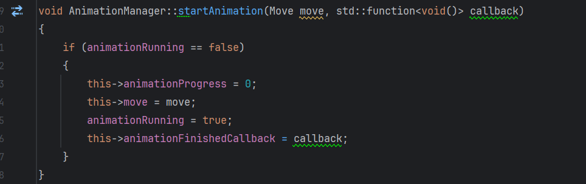

# OpenGL - Rubik's Cube

**Grafica pe calculator - proiect 3d**

*Eduard-Valentin Dumitrescul - grupa 332*

### 1. Conceptul proiectului
Reprezentarea 3d a unui cub rubik interactiv

### 2. Elemente incluse

- iluminare
- umbra
- ceata
- cuaternioni

- animatii


### 3. Originalitate
Implementarea folosing strict principii de baza ale OpenGL si C++.

### 4. Capturi de ecran


#### Cuaternioni
```
glm::quat deltaRotation = glm::angleAxis(glm::radians(90.0f) * sign, glm::vec3(0.0f, 1.0f, 0.0f));
            glm::quat interpolatedRotation = glm::slerp({1, 0, 0, 0}, deltaRotation, 1.0f * animationProgress / animationDuration);
            cubes[i][j][k]->setAnimationRotation(interpolatedRotation);
```

```
    glm::quat rotation = {1,0 , 0, 0};
    glm::quat animationRotation = {1, 0, 0, 0};
```